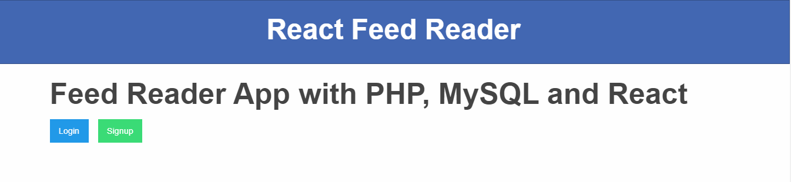
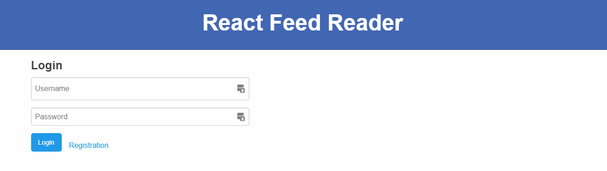
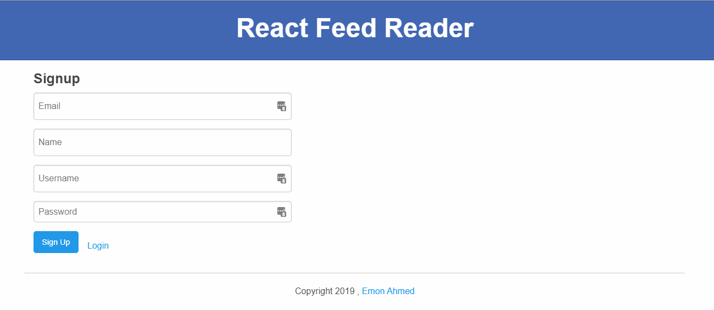

# Feed Reader App with PHP, MySQL and React

This is a small react app. Here, the authentication system is developed and feed entries are managed based on login user by using reactJS, mysql and PHP.

Step:1 - Create a database named reactdb.

Step:2 - Import database file (reactdb.sql). database file attached in here.

Step:3 - If you are using xampp Go to the htdocs or if you are using Wampserver Go to the www directory and put react-php , react_feed folder here.

Step:4 - Go to the react_feed folder and install npm using this comand at port:	

		npm install

Step:5 - Run the Feed Reader App using this command at port:

		npm start

Step:5 - login in feed reader using an existing user or you can register user.

 

 

 

 
